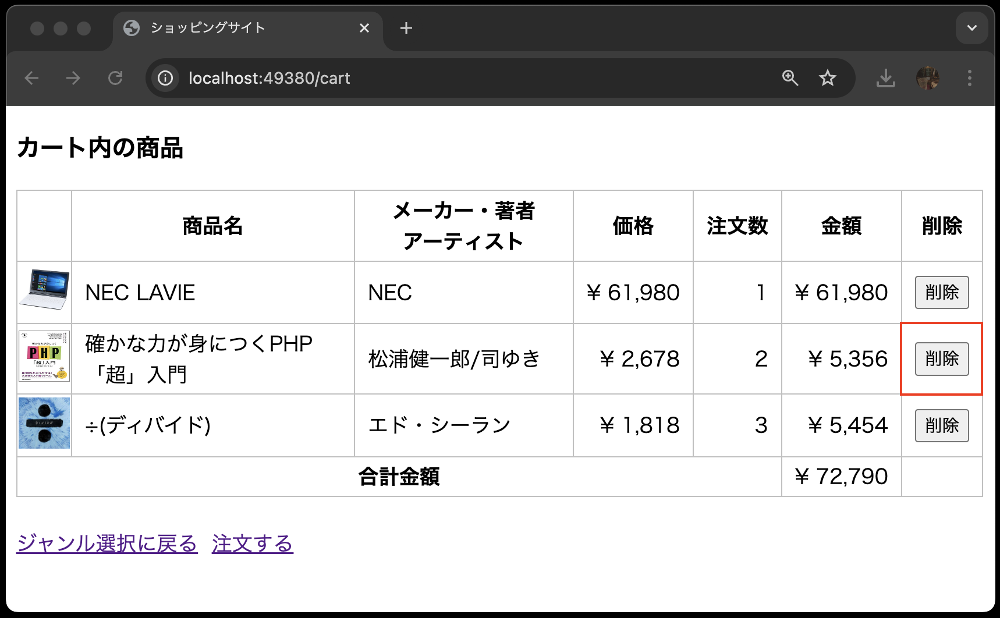
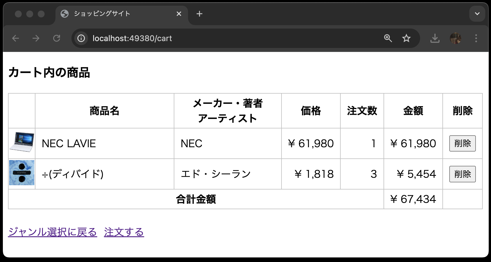
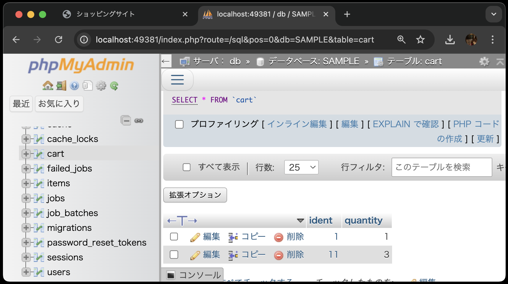

# カート内の商品画面(削除・更新機能)の仕様


- 削除ボタンを押すと、カート内の特定の商品が削除される
- 更新ボタンを押すと、カート内の商品の注文数が変更される

## ①データベース環境構築

新しくソースコードをcloneしたので、再度データベース環境構築をする必要があります。
`items`テーブルと`cart`テーブルを作成してください。

マイグレーションファイルとシーダーファイルがすでにあるので、`php artisan migrate:fresh --seed`でデータベースが構築されます。

## ②カートの削除機能を実装

まずは、カート内の商品を削除する機能を実装します。

### ◇②-1 ルーティングの設定

---

`routes/web.php`に以下のルーティングを追加します。

- `DELETE`リクエストを受け付けるルーティングであること
- URLが`cart/{xxxx}`であること(※ヒント:`xxxx`にはルートモデルバインディングを利用するための文字列が入ります)
- `CartController`の`destroy`メソッドを呼び出すこと
- ルーティング名を`cart.destroy`に設定すること

### ②-2 削除ボタンの追加

`resources/views/cart/index.blade.php`を以下のように修正します。
穴埋めになっている箇所は、[CRUD機能を作ろう！(UPDATE、DELETE編)](../shop_cart_delete_update/README.md)を参考に、埋めるようにしてください。


```php
<!DOCTYPE html>
<html lang="ja">
<head>
<meta charset="UTF-8">
<meta name="viewport" content="width=device-width, initial-scale=1.0">
<link rel="stylesheet" href="{{ asset('css/minishop.css')}}">
<title>ショッピングサイト</title>
</head>
<body>
    <!-- 以下を追加 -->
    <!-- カート内の情報が空になった場合の条件を定義する(穴埋め)-->
    @if(                    )
        <h3>カート内に商品はありません</h3>
        <!-- ジャンル選択画面へのルーティングを設定する(穴埋め) -->
        <a href="{{                }}">ジャンル選択に戻る</a>
    @else
    <!-- ここまで -->
        <h3>カート内の商品</h3>
        <table>
        <tr>
            <th>&nbsp;</th>
            <th>商品名</th>
            <th>メーカー・著者<br>アーティスト</th>
            <th>価格</th>
            <th>注文数</th>
            <th>金額</th>
            <th>削除</th> // 追加
        </tr>
        @php
            $total = 0;
        @endphp
        @foreach( $carts  as  $cart )
            <tr>
                <td class="td_mini_img">item->image )}}"></td>
                <td class="td_item_name"> {{ $cart->item->name }} </td>
                <td class="td_item_maker"> {{ $cart->item->maker }} </td>
                <td class="td_right">&yen; {{  number_format( $cart->item->price) }} </td>
                <td class="td_right"> {{ $cart->quantity }} </td>
                <td class="td_right">&yen; {{ number_format( $cart->item->price * $cart->quantity) }}</td>
                <!-- 以下を追加 -->
                <td>
                    <!-- action属性にルーティングを設定する(穴埋め) -->
                    <form method="POST" action="{{                                                 }}">
                        <!-- CSRF保護(穴埋め) -->
                        @
                        <!-- DELETEメソッドを使うことを指定する(穴埋め) -->
                        @
                        <input type="submit" value="削除">
                    </form>
                </td>
                <!-- ここまで -->
            </tr>
            @php
                $total += $cart->item->price * $cart->quantity;
            @endphp
        @endforeach
        <tr>
            <th colspan="5">合計金額</th><td class="td_right">&yen; {{ number_format($total) }}</td>
            <td>&nbsp;</td> // 追加
        </tr>
        </table>
        <br>
        <!-- 注文に関するルーティングはまだ作成していないので、href属性は空にしています -->
        <a href="{{ route('index') }}">ジャンル選択に戻る</a>&nbsp;&nbsp;<a href="">注文する</a>
    @endif
</body>
</html>
```


### ②-3 コントローラに削除機能を実装

---

`app/Http/Controllers/CartController.php`を以下のように修正します。

```php
<?php
namespace App\Http\Controllers;

use Illuminate\Http\Request;
use App\Models\Cart;

class CartController extends Controller
{
    // 途中省略

    // --- 以下を追加 ---
    // 引数にカートのオブジェクトを受け取る(穴埋め)
    public function destroy(          )
    {
        // レコードを削除する(穴埋め)
        $
        // カート内の商品一覧画面にリダイレクトする(穴埋め)
        return 
    }
    // --- ここまで追加 ---
}
```

以上で、カート内の商品を削除する機能が実装できました。

### ②-4 動作確認(削除機能)

以下のようにカート内の商品画面で削除ボタンを押し、商品が削除されることを確認してください。




phpMyAdminでもデータの整合性を確認してみましょう。

