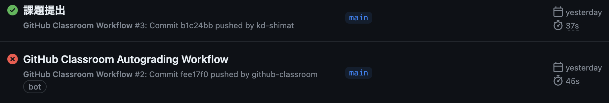

# 課題の提出について

提出した課題はGitHub上で自動採点されます。
従来通りGitHub上にpushすれば完了で、自動採点がはじまります。

## 課題の合格基準

以下を合格基準とします。

1. カート内の特定の商品を削除できる
2. カート内の特定商品の注文数を変更できる
3. カート内の商品がなくなると、`カート内に商品はありません`と表示される

## 合格確認方法

1. 本課題の[課題ページ](https://classroom.github.com/a/RJox63YJ)に再度アクセスする
2. 画面上部にある`Actions`をクリックする 

1. **一番上**の行に、緑色のチェックが入っていればOK 
