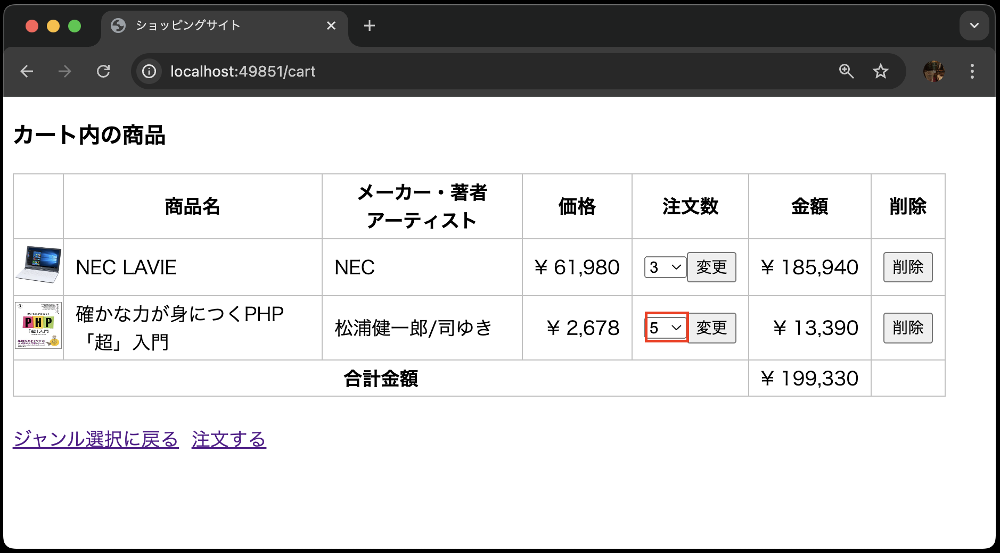
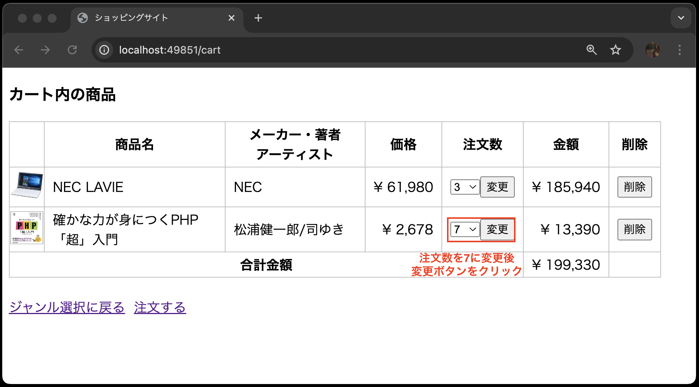
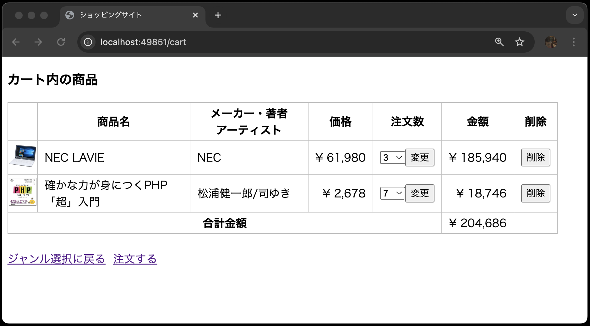
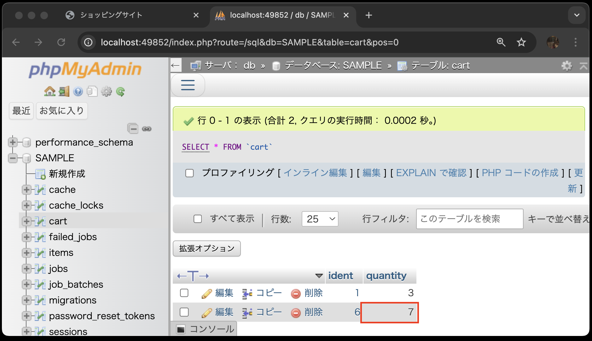

# ③カートの更新機能を実装

次に、カート内の商品の注文数を変更する機能を実装します。

### ◆③-1 ルーティングの設定

`routes/web.php`に以下のルーティングを追加します。

- `PATCH`リクエストを受け付けるルーティングであること
- URLが`cart/{xxxx}`であること(※ヒント:`xxxx`にはルートモデルバインディングを利用するための文字列が入ります)
- `CartController`の`update`メソッドを呼び出すこと
- ルーティング名を`cart.update`に設定すること

### ◆③-2 更新ボタンの追加

`resources/views/cart/index.blade.php`を以下のように修正します。


```php
<!DOCTYPE html>
<html lang="ja">
<head>
<meta charset="UTF-8">
<meta name="viewport" content="width=device-width, initial-scale=1.0">
<link rel="stylesheet" href="{{ asset('css/minishop.css')}}">
<title>ショッピングサイト</title>
</head>
<body>
    
    <!-- 途中省略 -->
        @foreach( $carts  as  $cart )
            <tr>
                <td class="td_mini_img">item->image )}}"></td>
                <td class="td_item_name"> {{ $cart->item->name }} </td>
                <td class="td_item_maker"> {{ $cart->item->maker }} </td>
                <td class="td_right">&yen; {{  number_format( $cart->item->price) }} </td>
                <!-- 既存の注文数はコメントアウト -->
                <!-- <td class="td_right"> {{ $cart->quantity }} </td> -->
                
                <!-- 以下を追加 -->
                <td>
                    <!-- action属性にルーティングを設定する(穴埋め) -->
                    <form method="POST" action="{{                                                 }}">
                        <!-- CSRF保護(穴埋め) -->
                        @
                        <!-- PATCHソッドを使うことを指定する(穴埋め) -->
                        @
                        <select name="quantity">
                            <!-- forディレクティブを使って、1から10までの選択肢を生成する(穴埋め) -->
                            @for (                      )
                                <!-- value属性にループ変数$iを設定する(穴埋め) -->
                                <option value="       "
                                <!-- ループ変数$iとカート内の商品の注文数が一致したらselectedを設定する(穴埋め) -->
                                @if(                    )
                                    selected
                                @endif
                                > {{ $i }} </option>
                            @endfor
                        </select>
                            &nbsp;
                            <input type="submit" value="変更">
                    </form>
                </td>
                <!-- ここまで、以下省略 -->
```


### ◆③-3 コントローラに更新機能を実装

`app/Http/Controllers/CartController.php`を以下のように修正します。

```php
<?php
namespace App\Http\Controllers;

use Illuminate\Http\Request;
use App\Models\Cart;

class CartController extends Controller
{
    // 途中省略

    // --- 以下を追加 ---
    // 引数にリクストのオブジェクトとカートのオブジェクトを受け取る(穴埋め)
    public function update(                            )
    {
        // バリデーションを行う(穴埋め)
        $validated = $request->validate([
            
        ]);
        // カートの注文数を更新する(穴埋め)
        $
        // カート内の商品一覧画面にリダイレクトする(穴埋め)
        return 
    }
    // --- ここまで ---
}
```

### ◆③-4 動作確認(更新機能)

以下のようにカート内の商品画面で注文数を変更し、更新ボタンを押すと、注文数が変更されることを確認してください。





phpMyAdminでもデータの整合性を確認してみましょう。
